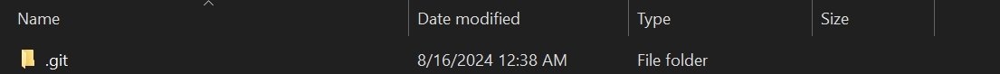
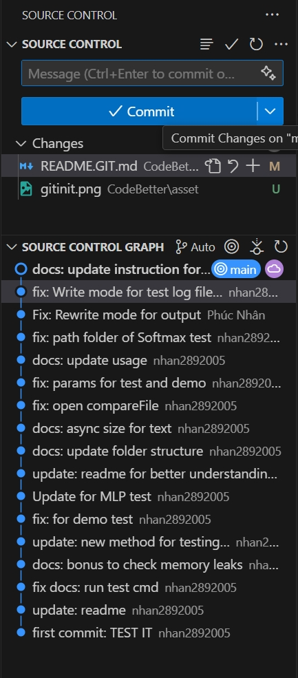

# Hướng dẫn cài đặt và sử dụng Git trên Windows

## 1. Cài đặt Git trên Windows

### Bước 1: Tải Git
Truy cập trang chủ của Git để tải phiên bản mới nhất cho Windows:

[Download Git for Windows](https://git-scm.com/download/win)

**Để cài đặt Git trên WSL**, bạn sử dụng trình quản lý gói của bản phân phối Linux. Nếu bạn đang dùng Ubuntu, hãy chạy lệnh sau:

```bash
sudo apt update
sudo apt install git
```

### Bước 2: Cài đặt Git
1. Chạy file cài đặt vừa tải về.

2. Trong quá trình cài đặt, chọn các tùy chọn mặc định. Đảm bảo rằng bạn chọn "Git from the command line and also from 3rd-party software" để tích hợp Git với PowerShell hoặc Command Prompt.

3. Chọn trình soạn thảo mặc định mà bạn muốn dùng (ví dụ: Visual Studio Code).

### Bước 3: Kiểm tra cài đặt Git
Sau khi cài đặt xong, mở **Terminal** và nhập lệnh sau để kiểm tra phiên bản Git:

```bash
git --version
```

Nếu thấy thông tin phiên bản hiện ra, Git đã được cài đặt thành công.

### Bước 4: Cấu hình Git
Thiết lập tên người dùng và email, đây là thông tin sẽ hiển thị trong các commit:

```bash
git config --global user.name "Tên của bạn"
git config --global user.email "email@example.com"
```

## 2. Sử dụng Git cơ bản

### Bước 1: Khởi tạo Git repository
Di chuyển đến thư mục mà bạn muốn quản lý bằng Git, sau đó khởi tạo repository:

```bash
cd <đường_dẫn_tới_thư_mục>
git init
```

Lệnh này sẽ tạo một thư mục `.git` ẩn để quản lý phiên bản cho dự án.



### Bước 2: Kiểm tra trạng thái của repository
Dùng lệnh sau để kiểm tra trạng thái của repository, hiển thị các file đã thay đổi hoặc chưa được commit:

```bash
git status
```

### Bước 3: Thêm file vào staging area
Để thêm tất cả các file mới hoặc đã thay đổi vào **staging area** trước khi commit:

```bash
git add .
```

Bạn cũng có thể thêm từng file cụ thể:

```bash
git add <tên_file>
```

### Bước 4: Commit thay đổi
Commit các thay đổi với thông điệp mô tả:

```bash
git commit -m "Thông điệp commit"
```

### Bước 5: Kiểm tra lịch sử commit
Dùng lệnh sau để xem lịch sử các commit trong repository:

```bash
git log
```

## 3. Đẩy code lên GitHub

### Bước 1: Tạo repository trên GitHub
Truy cập [GitHub](https://github.com/), đăng nhập và tạo một repository mới.

### Bước 2: Kết nối repository với GitHub
Kết nối repository local với GitHub bằng lệnh:

```bash
git remote add origin https://github.com/username/repository.git
```

Thay `username` bằng tên tài khoản GitHub của bạn và `repository` bằng tên repository mà bạn vừa tạo.

### Bước 3: Đẩy code lên GitHub
Đẩy toàn bộ code từ local repository lên GitHub:

```bash
git push -u origin master
```

Lệnh này sẽ đẩy branch `master` lên repository GitHub.

### Bước 4: Kéo code từ GitHub về local
Nếu có các thay đổi trên GitHub và bạn muốn kéo về máy local:

```bash
git pull origin master
```

Lệnh này sẽ kéo các thay đổi từ branch `master` trên GitHub về máy tính.

## 4. Tích hợp Git với Visual Studio Code

### Bước 1: Cài đặt Visual Studio Code
Nếu chưa có VSCode, bạn có thể tải và cài đặt từ [trang chủ VSCode](https://code.visualstudio.com/).

### Bước 2: Mở folder có Git repository trong VSCode
Bạn có thể mở bất kỳ thư mục nào đã khởi tạo Git repository trong VSCode. Khi bạn mở, VSCode sẽ tự động nhận diện repository Git và cung cấp các tính năng Git ngay trong giao diện.

### Bước 3: Thực hiện các thao tác Git từ VSCode
Trong VSCode, bạn có thể thực hiện các thao tác Git cơ bản từ thanh sidebar:
- **Source Control View** (Ctrl + Shift + G): Xem trạng thái các file đã thay đổi.
- **Commit**: Thêm thông điệp và commit trực tiếp trong VSCode.
- **Push/Pull**: Đẩy hoặc kéo các thay đổi từ GitHub.



## 5. Các lệnh Git cơ bản khác

- **Xem chi tiết các thay đổi trong file**:
  
  ```bash
  git diff
  ```

- **Tạo một nhánh mới**:

  ```bash
  git checkout -b <tên_nhánh>
  ```

- **Hợp nhất một nhánh vào nhánh chính**:

  ```bash
  git checkout master
  git merge <tên_nhánh>
  ```

- **Xóa một nhánh**:

  ```bash
  git branch -d <tên_nhánh>
  ```

## 6. Tài liệu tham khảo

- [Git Documentation](https://git-scm.com/doc)
- [GitHub Guides](https://guides.github.com/)
- [VSCode Documentation](https://code.visualstudio.com/docs)
