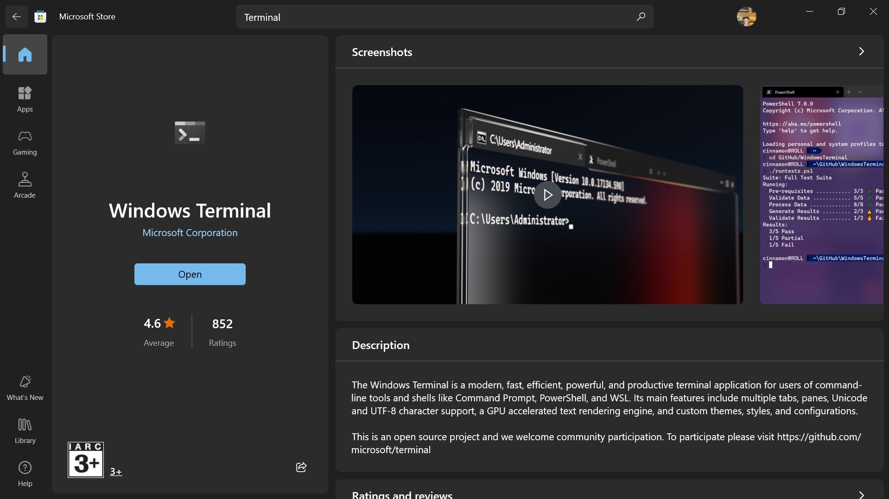
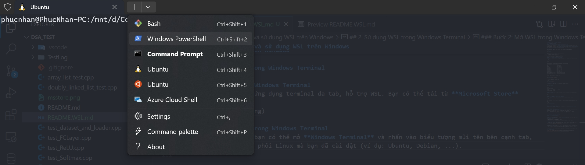
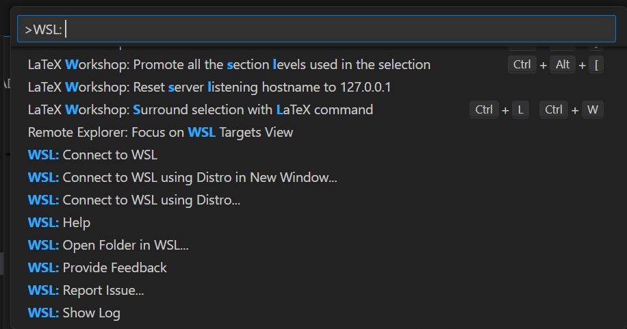

# Hướng dẫn cài đặt và sử dụng WSL trên Windows

## 1. Cài đặt WSL trên Windows

### Bước 1: Mở Command Prompt hoặc PowerShell với quyền quản trị viên
Để bắt đầu cài đặt WSL, bạn cần mở **Command Prompt** hoặc **PowerShell** dưới quyền quản trị viên.

- Nhấn tổ hợp phím `Windows + X`, chọn **Command Prompt (Admin)** hoặc **Windows PowerShell (Admin)**.
- Bạn cũng có thể tìm kiếm từ khóa "cmd" hoặc "PowerShell" trong thanh tìm kiếm của Windows, nhấn chuột phải vào ứng dụng và chọn **Run as Administrator**.

### Bước 2: Cài đặt WSL
Dùng lệnh sau để cài đặt WSL, đồng thời sẽ cài luôn bản phân phối Ubuntu mặc định:

```bash
wsl --install
```

Lệnh này sẽ:
1. Kích hoạt tính năng WSL (Windows Subsystem for Linux).
2. Cài đặt nhân (kernel) Linux cho WSL.
3. Cài đặt bản phân phối Linux mặc định là Ubuntu.

Quá trình này có thể yêu cầu khởi động lại máy tính.

### Bước 3: Cài đặt phiên bản Linux khác (tùy chọn)
Nếu bạn muốn cài đặt bản phân phối khác ngoài Ubuntu, bạn có thể xem danh sách các phiên bản có sẵn:

```bash
wsl --list --online
```

Output:
```
$ wsl --list --online
The following is a list of valid distributions that can be installed.
Install using 'wsl.exe --install <Distro>'.       

NAME                            FRIENDLY NAME     
Ubuntu                          Ubuntu
Debian                          Debian GNU/Linux  
kali-linux                      Kali Linux Rolling
Ubuntu-18.04                    Ubuntu 18.04 LTS
Ubuntu-20.04                    Ubuntu 20.04 LTS
Ubuntu-22.04                    Ubuntu 22.04 LTS
Ubuntu-24.04                    Ubuntu 24.04 LTS
OracleLinux_7_9                 Oracle Linux 7.9
OracleLinux_8_7                 Oracle Linux 8.7
OracleLinux_9_1                 Oracle Linux 9.1
openSUSE-Leap-15.6              openSUSE Leap 15.6
SUSE-Linux-Enterprise-15-SP5    SUSE Linux Enterprise 15 SP5
SUSE-Linux-Enterprise-15-SP6    SUSE Linux Enterprise 15 SP6
openSUSE-Tumbleweed             openSUSE Tumbleweed
```

Sau đó cài đặt phiên bản bạn muốn bằng lệnh:

```bash
wsl --install -d <Tên_phân_phối>
```

Ví dụ, để cài đặt Ubuntu, bạn chạy lệnh:

```bash
wsl --install -d Ubuntu
```

### Bước 4: Kiểm tra cài đặt
Để kiểm tra WSL đã được cài đặt thành công hay chưa, bạn dùng lệnh sau:

```bash
wsl --list --verbose
```

Output:
```
wsl --list --verbose
  NAME              STATE           VERSION
* Ubuntu            Stopped         2
  docker-desktop    Stopped         2
```

### Bước 5: Khởi chạy WSL
Sau khi cài đặt xong, bạn có thể khởi chạy WSL bằng lệnh sau trong Command Prompt hoặc PowerShell:

```bash
wsl
```

### Bước 6: Cập nhật WSL lên phiên bản WSL 2 (Optionals)
WSL 2 có hiệu năng tốt hơn và hỗ trợ đầy đủ nhân Linux. Để cập nhật, bạn chạy lệnh sau:

```bash
wsl --set-version <Tên_phân_phối> 2
```

> Nếu bạn muốn đặt WSL 2 làm phiên bản mặc định cho tất cả các bản phân phối trong tương lai, chạy lệnh:

```bash
wsl --set-default-version 2
```

## 2. Sử dụng WSL trong Windows Terminal

### Bước 1: Cài đặt Windows Terminal
Windows Terminal là ứng dụng terminal đa tab, hỗ trợ WSL. Bạn có thể tải từ **Microsoft Store**



### Bước 2: Mở WSL trong Windows Terminal
Khi đã cài đặt WSL, bạn có thể mở **Windows Terminal** và nhấn vào biểu tượng mũi tên bên cạnh tab, sau đó chọn bản phân phối Linux mà bạn đã cài đặt (ví dụ: Ubuntu, Debian, ...).

Ngoài ra, bạn có thể nhấn `Ctrl + Shift + T` để mở tab mới và nhập lệnh `wsl` để khởi chạy.



## 3. Tích hợp WSL trong Visual Studio Code

### Bước 1: Cài đặt Visual Studio Code
Bạn có thể tải Visual Studio Code từ [trang chủ VSCode](https://code.visualstudio.com/).

### Bước 2: Cài đặt WSL Extension
Sau khi cài đặt VSCode, mở ứng dụng và truy cập **Extensions** (hoặc nhấn `Ctrl + Shift + X`) và tìm kiếm **Remote - WSL**.

Cài đặt extension này để tích hợp WSL với VSCode.

### Bước 3: Mở WSL trong VSCode
1. Sau khi cài đặt extension, bạn có thể mở một folder trực tiếp trong WSL bằng cách nhấn `Ctrl + Shift + P`, sau đó chọn `Remote-WSL: New Window`.
2. Bạn có thể mở bất kỳ thư mục nào trong WSL bằng cách nhập đường dẫn của thư mục Linux.



### Bước 4: Sử dụng VSCode với WSL
Sau khi đã kết nối VSCode với WSL, bạn có thể viết, chạy và debug code trực tiếp trên hệ thống Linux mà không cần phải rời khỏi môi trường Windows. Bạn cũng có thể mở terminal tích hợp của VSCode và chọn môi trường WSL để làm việc.

## 4. Tài liệu tham khảo

- [Hướng dẫn sử dụng WSL từ Microsoft Docs](https://docs.microsoft.com/en-us/windows/wsl/)
- [Visual Studio Code Documentation](https://code.visualstudio.com/docs)
